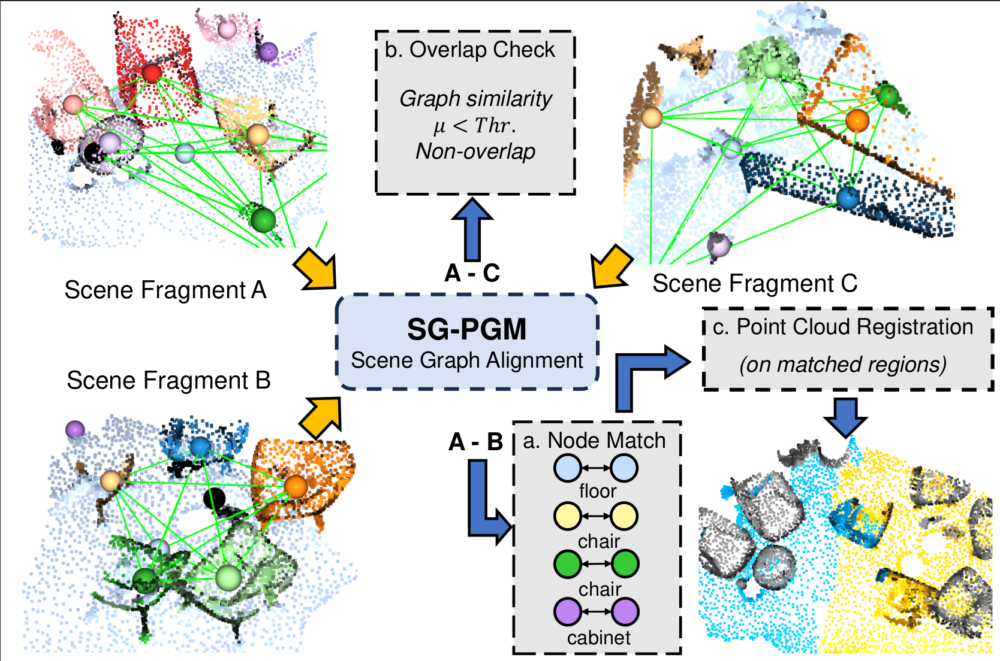

# SG-PGM

SG-PGM is a partial graph matching method for 3D scene graph alignment.

## Introduction

Scene graphs have been recently introduced into 3D spatial understanding as a comprehensive representation of the scene. The alignment between 3D scene graphs is the first step of many downstream tasks such as scene graph aided point cloud registration, mosaicking, overlap checking, and robot navigation. In the paper, we treat 3D scene graph alignment as a partial graph matching problem and propose to solve it with a graph neural network. 
We reuse the geometric features learned by the point cloud registration method and associate the clustered point-level geometric features with the node-level semantic feature via our designed feature fusion module. Partial matching is enabled by using a learnable method to select the top-K similar node pairs. Subsequent downstream tasks such as point cloud registration are achieved by running a pre-trained registration network within the matched regions.We further propose a point-matching rescoring method, that uses the node-wise alignment of the 3D scene graph to reweight the matching candidates from a pre-trained point cloud registration method. It reduces the false point correspondence estimated especially in low-overlapping cases. Experiments show that our method improves the alignment accuracy by 10~20\% in low-overlap and random transformation scenarios and outperforms the existing work in multiple downstream tasks.



## Installation
```
# Build conda environment
conda create -n sg-pgm python==3.9
conda activate sg-pgm
conda install pytorch torchvision pytorch-cuda=12.1 -c pytorch -c nvidia
conda install pyg -c pyg
pip install -r requirements.txt

# Install the grid sampling ext for points and semantic labels
python setup.py build develop
```

## Download Pre-trained Weights
It comes later...

## Inference for 3D Scene Graph Alignment and Downstream Tasks
```
# Test Alignment and Registration with Transformaitn Augmentation 
python scripts/inference_reg.py --trained_model=./weights/the_weights.pth --ptfusion --sgfusion --topk --rand_trans

# Test Overlap Checking
python scripts/inference_overlap.py --trained_model=./weights/the_weights.pth --ptfusion --sgfusion --topk

# Test on Scene with Dynamics
python scripts/inference_dynamics.py --trained_model=./weights/the_weights.pth --ptfusion --sgfusion --topk
```

## Train Network with Reproducibility
```
python script/train.py --ptfusion --sgfuison --topk --rand_trans
```


